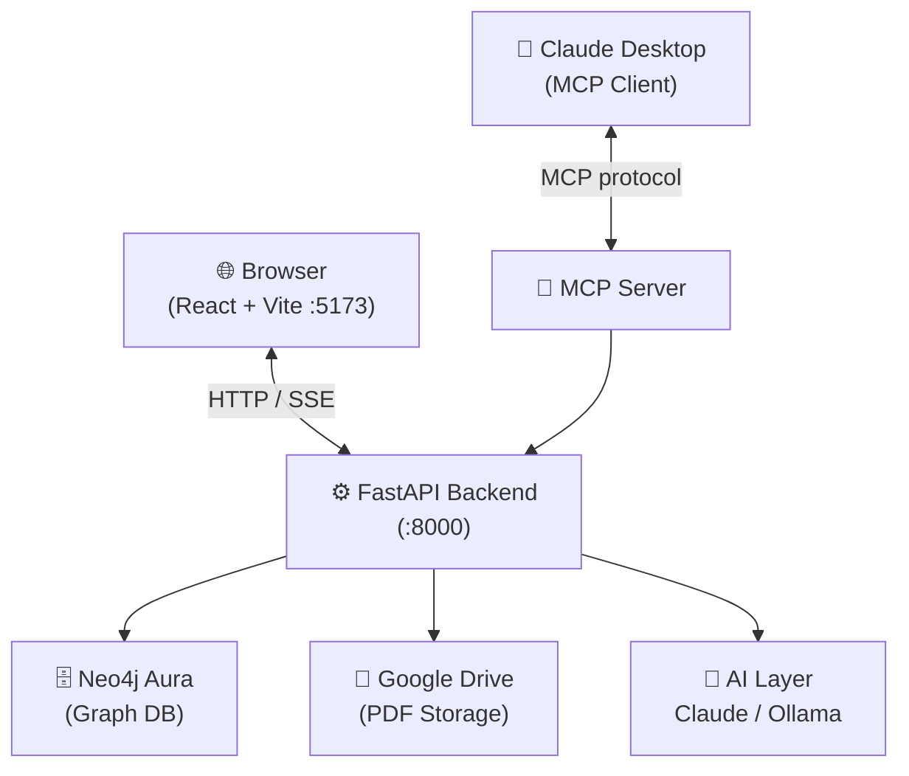

# PaperManager Documentation

**PaperManager** is a personal academic paper manager. Upload PDFs, ingest papers from URLs, chat with papers using AI, explore a knowledge graph of authors and topics, and track references — all in a local web app backed by Neo4j and Google Drive.

---

## ✨ What You Can Do

<div class="grid cards" markdown>

-   :material-file-upload: **Ingest Papers**

    Upload PDFs or paste URLs/DOIs. Metadata extracted automatically from Semantic Scholar, CrossRef, arXiv, PubMed, or via local AI.

    [:octicons-arrow-right-24: Ingesting Papers](user-guide/ingestion.md)

-   :material-bookshelf: **Browse Your Library**

    Full-text search, filter by tags/topics/projects/people, sort, and switch between grid and list views.

    [:octicons-arrow-right-24: Library](user-guide/library.md)

-   :material-robot: **Chat with Papers**

    Ask questions about individual papers or across your whole library using Claude (Anthropic) or Ollama (local).

    [:octicons-arrow-right-24: Paper Detail](user-guide/paper-detail.md)

-   :material-graph: **Knowledge Graph**

    Interactive WebGL graph showing how papers, authors, topics, projects, and notes connect.

    [:octicons-arrow-right-24: Knowledge Features](user-guide/knowledge-features.md)

-   :material-tag-multiple: **Tags & Topics**

    157 seeded tags across source, workflow, content-type, math, ML/AI, biology, and drug-discovery categories.

    [:octicons-arrow-right-24: Library Filters](user-guide/library.md#filters)

-   :material-connection: **MCP Server**

    Integrate with Claude Desktop to manage your library via natural language tool calls.

    [:octicons-arrow-right-24: MCP Server](user-guide/mcp-server.md)

</div>

---

## Quick Start

```bash
# 1. Clone and enter
git clone https://github.com/NiklasAbraham/PaperManager && cd PaperManager

# 2. Create conda env
conda create -n papermanager python=3.11 -y
conda activate papermanager
pip install -r backend/requirements.txt

# 3. Install frontend
cd frontend && npm install && cd ..

# 4. Copy and fill in your .env
cp .env.example .env
# Edit .env — see Configuration section

# 5. Start everything
./start.sh
# Opens http://localhost:5173
```

`start.sh` starts the FastAPI backend (port 8000), the Vite frontend (port 5173), and optionally Ollama. Logs go to `/tmp/papermanager-backend.log` and `/tmp/papermanager-frontend.log`.

---

## Architecture at a Glance



See [Architecture](technical/architecture.md) for full technical detail.

---

## Documentation Map

| Section | What it covers |
|---------|---------------|
| [Getting Started](user-guide/getting-started.md) | Installation, configuration, first run |
| [Ingesting Papers](user-guide/ingestion.md) | PDF upload, URL/DOI ingest, bulk import |
| [Library](user-guide/library.md) | Browsing, searching, filtering, sorting |
| [Paper Detail](user-guide/paper-detail.md) | Metadata, PDF viewer, figures, notes, chat, references |
| [Knowledge Features](user-guide/knowledge-features.md) | Graph, knowledge chat, Cypher editor |
| [MCP Server](user-guide/mcp-server.md) | Claude Desktop integration |
| [Architecture](technical/architecture.md) | System design and module interaction diagrams |
| [Backend](technical/backend.md) | FastAPI routers, services, DB queries |
| [Frontend](technical/frontend.md) | React pages and components |
| [Data Model](technical/data-model.md) | Neo4j graph schema |
| [AI Pipelines](technical/ai-pipelines.md) | Metadata extraction, summarisation, chat |
| [API Reference](technical/api-reference.md) | All REST endpoints |
| [Decisions Log](decisions.md) | Architecture decision record |
