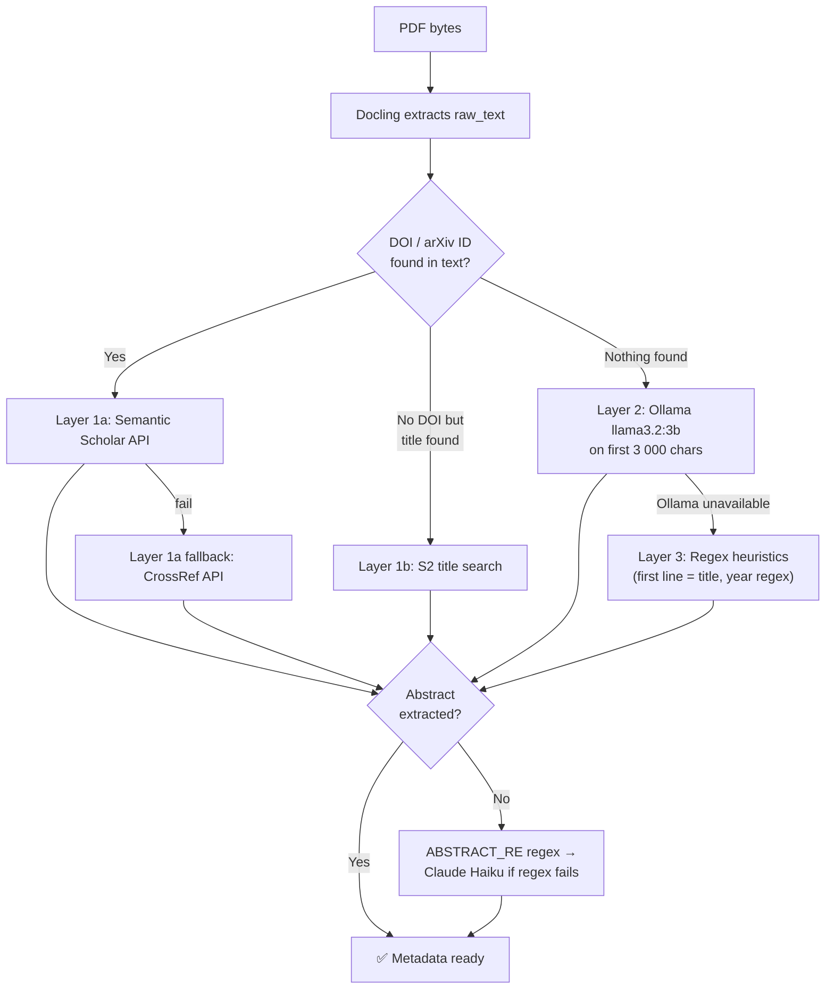
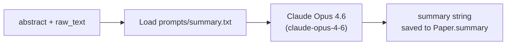
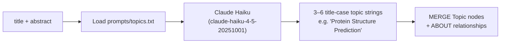
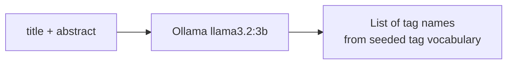
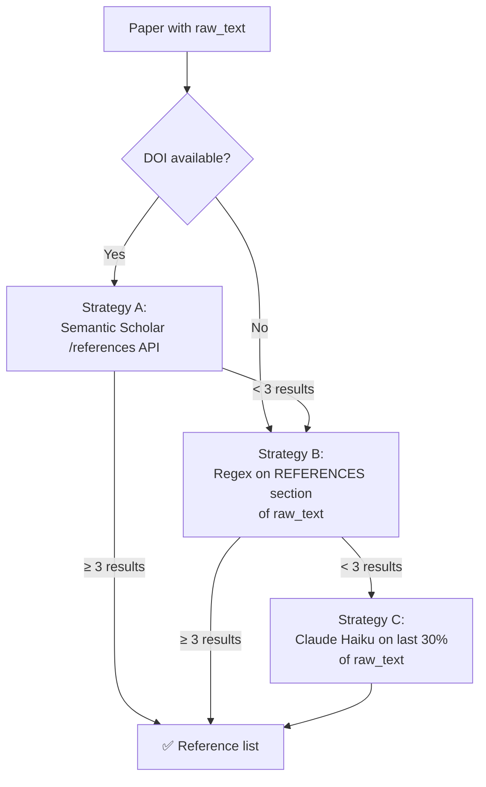
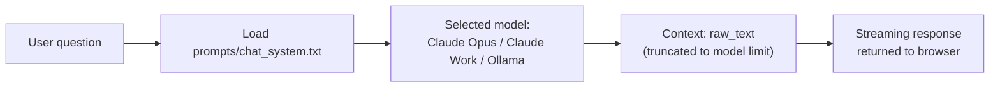
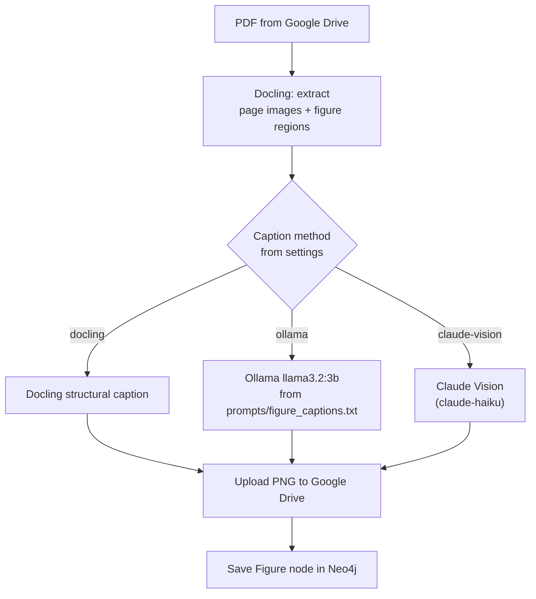
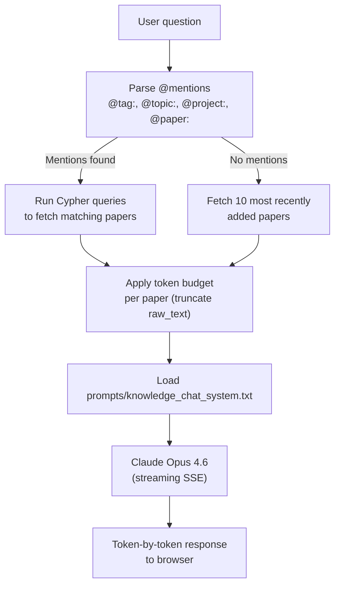
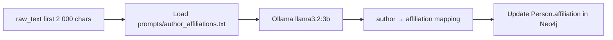

# AI Pipelines

PaperManager uses multiple AI models for different tasks. This page documents each pipeline, the models used, and how they fit together.

---

## Models Used

| Model | Provider | Used for |
|-------|----------|----------|
| `claude-opus-4-6` | Anthropic | Paper summarisation, single-paper chat, knowledge chat |
| `claude-haiku-4-5-20251001` | Anthropic | Abstract extraction, reference extraction, topic suggestion, conversation compaction |
| `llama3.2:3b` | Ollama (local) | Metadata extraction (layer 2), tag suggestion, arXiv query generation, figure captions, affiliation extraction, Cypher assist |
| Claude Vision | Anthropic | Figure chat, figure captioning (claude-vision mode) |

All Anthropic calls can be routed through an enterprise Foundry gateway by setting `ANTHROPIC_WORK_API_KEY` and `ANTHROPIC_WORK_BASE_URL`.

---

## Metadata Extraction Pipeline (PDF Upload)

Runs when a PDF is uploaded. Tries four strategies in order, stopping at the first success:



### Layer Details

| Layer | Trigger | Service | Output |
|-------|---------|---------|--------|
| 1a (primary) | DOI or arXiv ID in text | `services/metadata_lookup.py` → Semantic Scholar | title, year, authors, abstract, topics, citation count, venue |
| 1a (fallback) | S2 fails | CrossRef API | title, year, authors, doi, venue |
| 1b | Title found, no DOI | S2 title search | same as 1a |
| 2 | No DOI, no useful title | Ollama `llama3.2:3b` on `raw_text[:3000]` | title, year, authors (structured JSON) |
| 3 | Ollama unavailable | Regex on raw_text | title (first non-empty line), year (4-digit year regex) |
| Abstract fallback | Abstract still missing | `ABSTRACT_RE` regex → Claude Haiku | abstract text |

The `metadata_source` property on the Paper node records which layer was used.

---

## Paper Summarisation

Triggered after PDF upload or via `POST /backfill/summary`.



The prompt template at `prompts/summary.txt` structures the output as:
- Problem / motivation
- Key method or contribution
- Main findings
- Relevance

---

## Topic Suggestion

Triggered during upload or via `POST /papers/{id}/topics/suggest` or bulk backfill.



---

## Tag Suggestion

Triggered in the upload modal (optional step) or via `POST /tags/suggest`.



Ollama is constrained to suggest only tags from the existing tag vocabulary.

---

## Reference Extraction Pipeline

Triggered when the user clicks "Extract References" on the Paper Detail page, or via `GET /papers/{id}/extract-references`.



Each extracted reference creates a `Paper` stub node (title + DOI) tagged `from-references` and linked via `CITES`. Stubs are enriched if the full paper is later imported.

---

## Single-Paper Chat

Triggered via `POST /papers/{id}/chat`.



---

## Figure Extraction & Captioning

Triggered via `POST /papers/{id}/figures/extract`.



---

## Figure Vision Chat

Triggered via `POST /papers/{id}/figures/{fig_id}/chat`.

The figure image is retrieved from Google Drive and sent to Claude with the question:

```
System: You are analysing a scientific figure.
User: [image bytes] + question text
```

---

## Knowledge Chat Context Assembly

Triggered via `POST /knowledge-chat/stream`.



---

## Affiliation Extraction

Triggered as part of the paper upload when author affiliations are missing.



---

## Prompt Templates

All prompts live in `prompts/` and are loaded fresh on each call — edit without restarting:

| File | Used in | Purpose |
|------|---------|---------|
| `summary.txt` | `ai.py` | Paper summarisation |
| `topics.txt` | `ai.py` | Topic suggestion |
| `chat_system.txt` | `ai.py` | Single-paper Q&A system prompt |
| `knowledge_chat_system.txt` | `knowledge_chat.py` | Multi-paper synthesis system prompt |
| `figure_captions.txt` | `figure_extractor.py` | Figure caption generation |
| `author_affiliations.txt` | `pdf_parser.py` | Author affiliation extraction |
