# AI Pipelines

PaperManager uses multiple AI models for different tasks. This page documents each pipeline, the models used, and how they fit together.

---

## Models Used

| Model | Provider | Used for |
| ----- | -------- | -------- |
| `claude-opus-4-6` | Anthropic | Paper summarisation, single-paper chat, knowledge chat, cross-paper synthesis, research gap analysis |
| `claude-haiku-4-5-20251001` | Anthropic | Abstract extraction, reference extraction, topic suggestion, claim extraction, chapter summarisation, conversation compaction, figure captioning (claude-vision mode) |
| `llama3.2:3b` | Ollama (local) | Metadata extraction (layer 2), tag suggestion, chapter detection, figure captions (default), affiliation extraction, Cypher assist, merge scan |
| `nomic-embed-text` | Ollama (local) | Paper embedding vectors for semantic similarity search |

All Anthropic calls can be routed through an enterprise Foundry gateway by setting `ANTHROPIC_WORK_API_KEY` and `ANTHROPIC_WORK_BASE_URL`.

---

## Metadata Extraction Pipeline (PDF Upload)

Runs when a PDF is uploaded. Tries strategies in order, stopping at the first success:

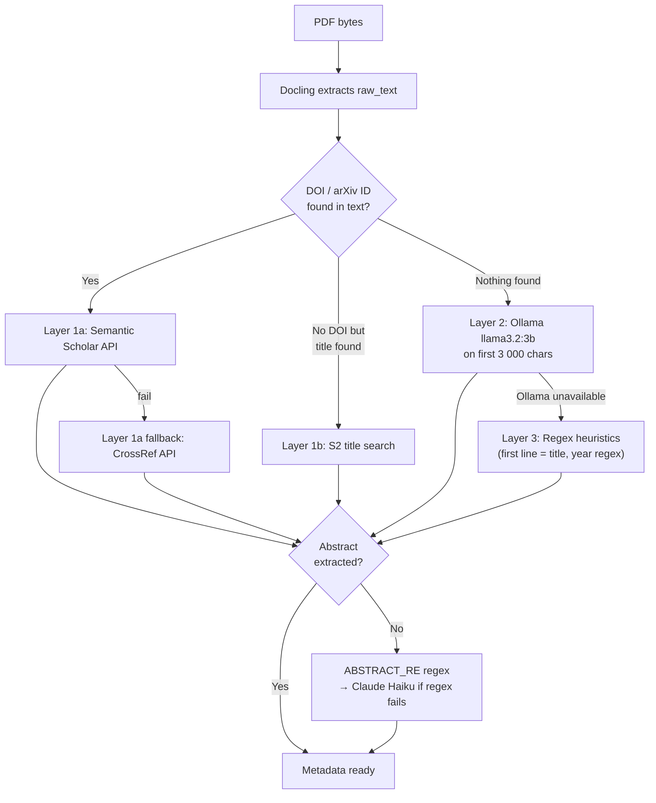
```mermaid
flowchart TD
    Start["PDF bytes"] --> Extract["Docling extracts raw_text"]
    Extract --> FindDOI{DOI / arXiv ID\nfound in text?}

    FindDOI -->|"Yes"| S2["Layer 1a: Semantic Scholar API"]
    S2 -->|fail| CR["Layer 1a fallback: CrossRef API"]

    FindDOI -->|"No DOI but\ntitle found"| S2Title["Layer 1b: S2 title search"]

    FindDOI -->|"Nothing found"| Ollama["Layer 2: Ollama llama3.2:3b\non first 3 000 chars"]
    Ollama -->|"Ollama unavailable"| Heuristic["Layer 3: Regex heuristics\n(first line = title, year regex)"]

    S2 --> AbstractCheck{Abstract\nextracted?}
    CR --> AbstractCheck
    S2Title --> AbstractCheck
    Ollama --> AbstractCheck
    Heuristic --> AbstractCheck

    AbstractCheck -->|"No"| AbstractFallback["ABSTRACT_RE regex\n→ Claude Haiku if regex fails"]
    AbstractCheck -->|"Yes"| Done["Metadata ready"]
    AbstractFallback --> Done
```

| Layer | Trigger | Service | Output |
| ----- | ------- | ------- | ------ |
| 1a (primary) | DOI or arXiv ID in text | Semantic Scholar API | title, year, authors, abstract, topics, citation count, venue |
| 1a (fallback) | S2 fails | CrossRef API | title, year, authors, doi, venue |
| 1b | Title found, no DOI | S2 title search | same as 1a |
| 2 | No DOI, no useful title | Ollama `llama3.2:3b` on `raw_text[:3000]` | title, year, authors (structured JSON) |
| 3 | Ollama unavailable | Regex on raw_text | title (first non-empty line), year (4-digit year regex) |
| Abstract fallback | Abstract still missing | `ABSTRACT_RE` regex → Claude Haiku | abstract text |

The `metadata_source` property on the Paper node records which layer was used.

---

## Paper Summarisation

Triggered after PDF upload or via `POST /backfill/summary` / `POST /{id}/regenerate-summary`.

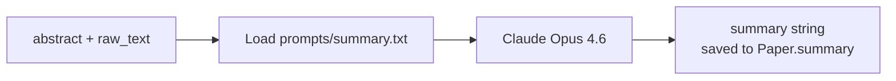
```mermaid
flowchart LR
    A["abstract + raw_text"] --> P["Load prompts/summary.txt"]
    P --> C["Claude Opus 4.6"]
    C --> S["summary string\nsaved to Paper.summary"]
```

The prompt at `prompts/summary.txt` structures output as: Problem / motivation · Key method or contribution · Main findings · Relevance.

---

## Topic Suggestion

Triggered during upload, via `POST /papers/{id}/topics/suggest`, or bulk backfill.

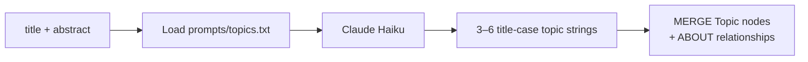
```mermaid
flowchart LR
    A["title + abstract"] --> P["Load prompts/topics.txt"]
    P --> C["Claude Haiku"]
    C --> T["3–6 title-case topic strings"]
    T --> DB["MERGE Topic nodes\n+ ABOUT relationships"]
```

---

## Tag Suggestion

Triggered in the upload modal (optional step) or via `POST /tags/suggest`.

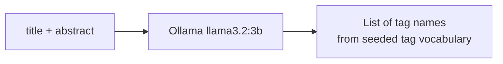
```mermaid
flowchart LR
    A["title + abstract"] --> O["Ollama llama3.2:3b"]
    O --> Tags["List of tag names\nfrom seeded tag vocabulary"]
```

---

## Reference Extraction Pipeline

Triggered via `GET /papers/{id}/extract-references` or `POST /papers/{id}/references`.

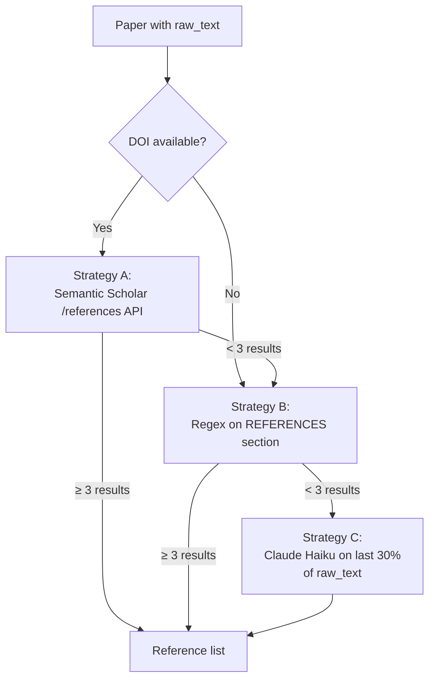
```mermaid
flowchart TD
    Start["Paper with raw_text"] --> A{DOI available?}
    A -->|"Yes"| S2["Strategy A:\nSemantic Scholar /references API"]
    A -->|"No"| B["Strategy B:\nRegex on REFERENCES section"]
    S2 -->|"< 3 results"| B
    B -->|"< 3 results"| Claude["Strategy C:\nClaude Haiku on last 30%\nof raw_text"]
    S2 -->|"≥ 3 results"| Done["Reference list"]
    B -->|"≥ 3 results"| Done
    Claude --> Done
```

Each reference creates a `Paper` stub node tagged `from-references` and linked via `CITES`. Stubs are enriched when the full paper is later imported.

---

## Claim Extraction

Triggered automatically during upload (for papers) or via `POST /papers/{id}/claims/extract`.

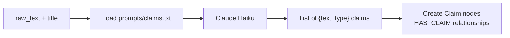
```mermaid
flowchart LR
    A["raw_text + title"] --> P["Load prompts/claims.txt"]
    P --> C["Claude Haiku"]
    C --> Claims["List of {text, type} claims"]
    Claims --> DB["Create Claim nodes\nHAS_CLAIM relationships"]
```

Claim types include `"finding"`, `"method"`, `"limitation"`, `"contribution"`.

---

## Paper Embedding

Triggered during upload (if enabled in settings) or via backfill.

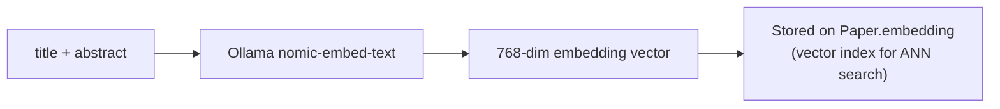
```mermaid
flowchart LR
    A["title + abstract"] --> O["Ollama nomic-embed-text"]
    O --> V["768-dim embedding vector"]
    V --> DB["Stored on Paper.embedding\n(vector index for ANN search)"]
```

---

## Single-Paper Chat

Triggered via `POST /papers/{id}/chat`.

The model is selected per-request: Claude Opus (default), Claude Work (enterprise gateway), or Ollama.

---

## Chapter Detection (Books / Lecture Decks)

Triggered via `POST /papers/{id}/chapters/detect`.

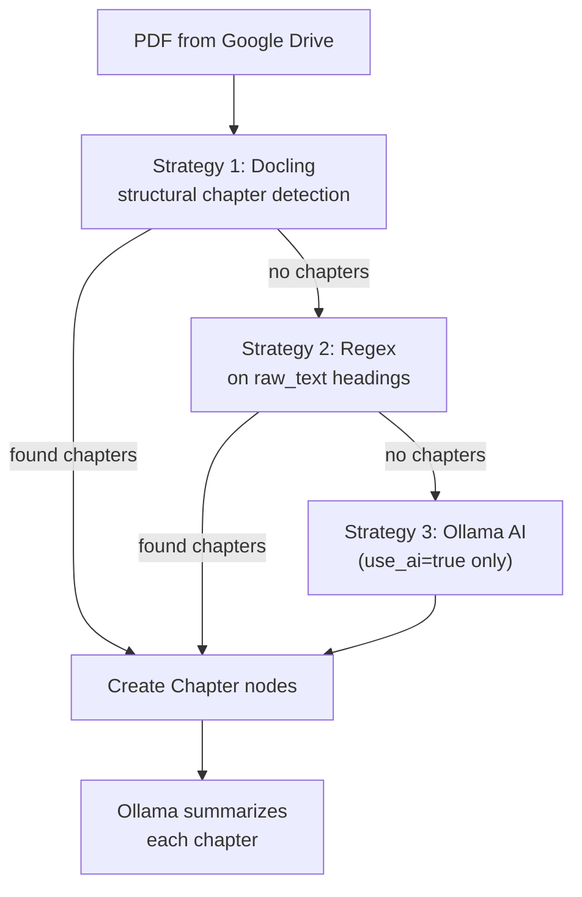
```mermaid
flowchart TD
    PDF["PDF from Google Drive"] --> Docling["Strategy 1: Docling\nstructural chapter detection"]
    Docling -->|"found chapters"| Done["Create Chapter nodes"]
    Docling -->|"no chapters"| Regex["Strategy 2: Regex\non raw_text headings"]
    Regex -->|"found chapters"| Done
    Regex -->|"no chapters"| AI["Strategy 3: Ollama AI\n(use_ai=true only)"]
    AI --> Done
    Done --> Summarize["Ollama summarizes\neach chapter"]
```

Each chapter node stores its text slice, title, level, page range, and summary.

Chapter chat uses `prompts/chapter_chat_system.txt` with Claude Haiku; chapter summary uses `prompts/chapter_summary.txt` with Ollama.

---

## Figure Extraction & Captioning

Triggered via `POST /papers/{id}/figures/extract`.

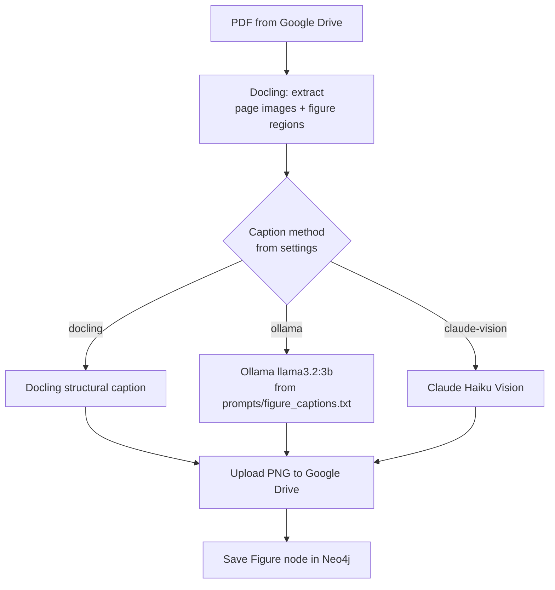
```mermaid
flowchart TD
    PDF["PDF from Google Drive"] --> Docling["Docling: extract\npage images + figure regions"]
    Docling --> Method{Caption method\nfrom settings}
    Method -->|"docling"| DocCaption["Docling structural caption"]
    Method -->|"ollama"| OllamaCaption["Ollama llama3.2:3b\nfrom prompts/figure_captions.txt"]
    Method -->|"claude-vision"| ClaudeCaption["Claude Haiku Vision"]
    DocCaption --> Upload["Upload PNG to Google Drive"]
    OllamaCaption --> Upload
    ClaudeCaption --> Upload
    Upload --> DB["Save Figure node in Neo4j"]
```

---

## Figure Vision Chat

Triggered via `POST /papers/{id}/figures/{fig_id}/chat`. The figure image is retrieved from Google Drive and sent to Claude with the question.

---

## Cross-Paper Synthesis

Triggered via `POST /synthesis`.

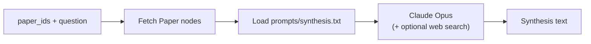
```mermaid
flowchart LR
    Q["paper_ids + question"] --> Papers["Fetch Paper nodes"]
    Papers --> P["Load prompts/synthesis.txt"]
    P --> C["Claude Opus\n(+ optional web search)"]
    C --> R["Synthesis text"]
```

---

## Research Gap Analysis

Triggered via `POST /research-gaps`.

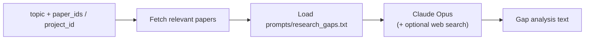
```mermaid
flowchart LR
    Q["topic + paper_ids / project_id"] --> Papers["Fetch relevant papers"]
    Papers --> P["Load prompts/research_gaps.txt"]
    P --> C["Claude Opus\n(+ optional web search)"]
    C --> R["Gap analysis text"]
```

---

## Knowledge Chat Context Assembly

Triggered via `POST /knowledge-chat/stream`.

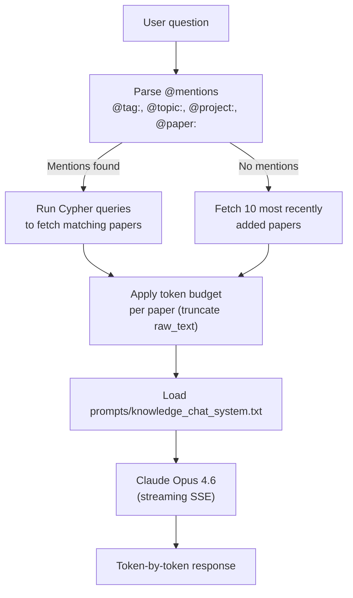
```mermaid
flowchart TD
    Q["User question"] --> Parse["Parse @mentions\n@tag:, @topic:, @project:, @paper:"]
    Parse -->|"Mentions found"| Cypher["Run Cypher queries\nto fetch matching papers"]
    Parse -->|"No mentions"| Recent["Fetch 10 most recently\nadded papers"]
    Cypher --> Budget["Apply token budget\nper paper (truncate raw_text)"]
    Recent --> Budget
    Budget --> System["Load prompts/knowledge_chat_system.txt"]
    System --> Claude["Claude Opus 4.6\n(streaming SSE)"]
    Claude --> Browser["Token-by-token response"]
```

---

## Affiliation Extraction

Triggered as part of paper upload when author affiliations are missing.

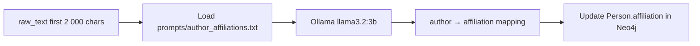
```mermaid
flowchart LR
    T["raw_text first 2 000 chars"] --> P["Load prompts/author_affiliations.txt"]
    P --> O["Ollama llama3.2:3b"]
    O --> A["author → affiliation mapping"]
    A --> DB["Update Person.affiliation in Neo4j"]
```

---

## Duplicate Detection (Merge Scan)

Triggered via `POST /merge/scan`.

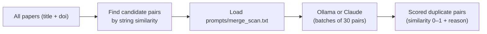
```mermaid
flowchart LR
    A["All papers (title + doi)"] --> Pairs["Find candidate pairs\nby string similarity"]
    Pairs --> P["Load prompts/merge_scan.txt"]
    P --> C["Ollama or Claude\n(batches of 30 pairs)"]
    C --> Results["Scored duplicate pairs\n(similarity 0–1 + reason)"]
```

---

## Literature Search Keywords

Triggered via `POST /literature/search`.

The keyword list in `prompts/literature_search_keywords.txt` (or a project's stored keywords) is used to query arXiv, PubMed, and bioRxiv. Results are streamed via SSE and marked as already-in-library where applicable.

---

## Prompt Templates

All prompts live in `prompts/` and are loaded fresh on each call:

| File | Used in | Purpose |
| ---- | ------- | ------- |
| `summary.txt` | `ai.py` | Paper summarisation |
| `topics.txt` | `ai.py` | Topic suggestion |
| `chat_system.txt` | `ai.py` | Single-paper Q&A system prompt |
| `knowledge_chat_system.txt` | `knowledge_chat.py` | Multi-paper synthesis system prompt |
| `figure_captions.txt` | `figure_extractor.py` | Figure caption generation |
| `author_affiliations.txt` | `pdf_parser.py` | Author affiliation extraction |
| `claims.txt` | `ai.py` | Claim extraction |
| `synthesis.txt` | `ai.py` | Cross-paper synthesis |
| `research_gaps.txt` | `ai.py` | Research gap analysis |
| `chapter_summary.txt` | `ai.py` | Chapter summarisation |
| `chapter_chat_system.txt` | `ai.py` | Chapter Q&A system prompt |
| `literature_search_keywords.txt` | `literature_search.py` | Default literature search keywords |
| `merge_scan.txt` | `merge.py` | Duplicate detection |
