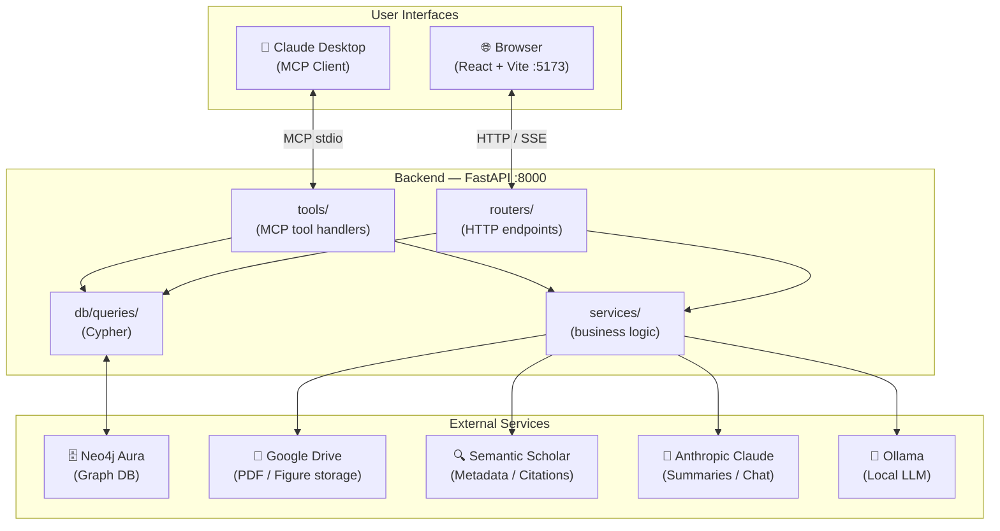
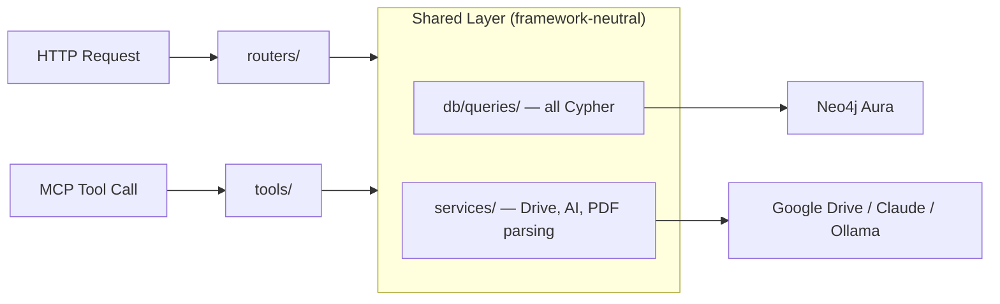
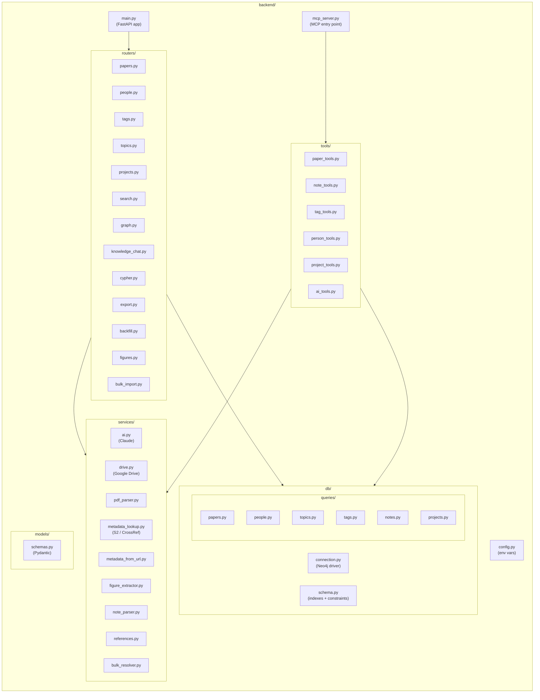
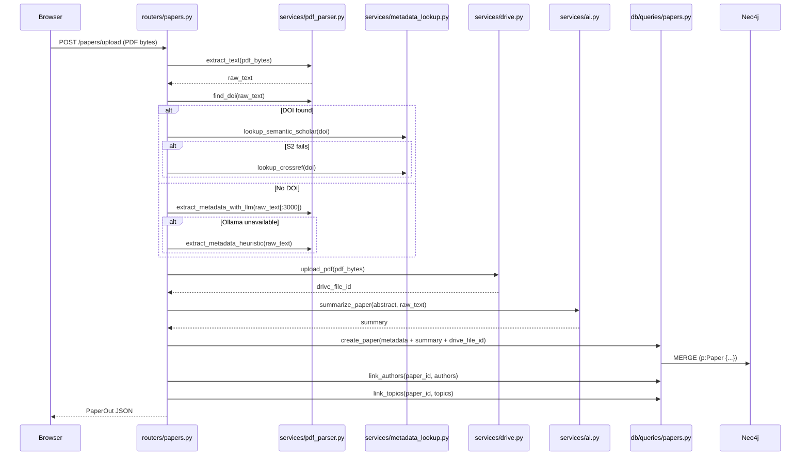
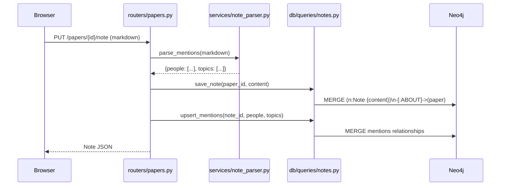

# Architecture

This page describes the overall system design of PaperManager, how the modules interact, and the key architectural principles.

---

## High-Level Overview

---

## The Shared Layer Principle

The most important architectural rule in PaperManager:

> **`db/queries/` and `services/` are framework-neutral.** Neither FastAPI nor MCP specifics leak into them. `routers/` and `tools/` are two different entry points over the same logic.

This means every capability is available both via HTTP (for the browser) and via MCP tool calls (for Claude Desktop), without any code duplication.

---

## Module Map

---

## Paper Ingestion Flow

The most complex path through the system — from PDF drop to fully enriched paper:

---

## Note Save Flow

---

## Key Design Decisions

See the full [Decisions Log](../decisions.md) for rationale. The key principles:

1. **Neo4j over SQL** — papers, people, topics, and tags are naturally a graph; enables path queries, co-authorship derivation, topic clustering
2. **Tags as nodes** — `(Paper)-[:TAGGED]->(Tag)` allows efficient "all papers with tag X" queries
3. **Topic ≠ Tag** — Topics are formal research areas linked to person specialties; Tags are free-form personal labels
4. **Notes as graph nodes** — Notes need their own `@mention` and `#topic` relationships; a text field on Paper would lose graph power
5. **Shared service layer** — MCP tools and HTTP routers call the same `db/` and `services/` code
6. **Prompts as files** — All prompt templates live in `prompts/` and are loaded fresh on each call; edit without restarting the backend
