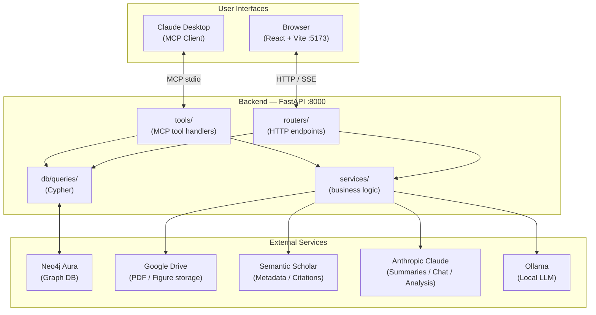
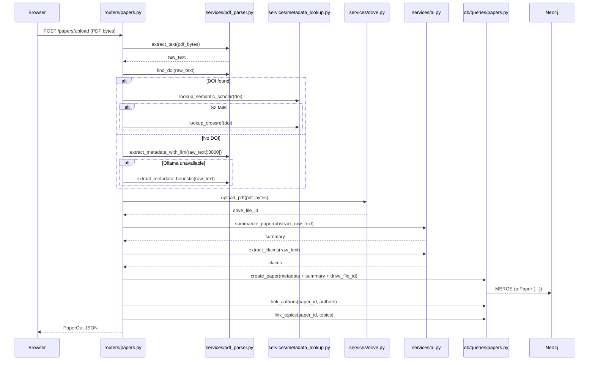

# Architecture

This page describes the overall system design of PaperManager, how the modules interact, and the key architectural principles.

---

## High-Level Overview

```mermaid
graph TB
    subgraph "User Interfaces"
        Browser["Browser\n(React + Vite :5173)"]
        ClaudeDesktop["Claude Desktop\n(MCP Client)"]
    end

    subgraph "Backend — FastAPI :8000"
        Routers["routers/\n(HTTP endpoints)"]
        MCPTools["tools/\n(MCP tool handlers)"]
        Services["services/\n(business logic)"]
        DBQueries["db/queries/\n(Cypher)"]
    end

    subgraph "External Services"
        Neo4j["Neo4j Aura\n(Graph DB)"]
        Drive["Google Drive\n(PDF / Figure storage)"]
        S2["Semantic Scholar\n(Metadata / Citations)"]
        Claude["Anthropic Claude\n(Summaries / Chat / Analysis)"]
        Ollama["Ollama\n(Local LLM)"]
    end

    Browser <-->|"HTTP / SSE"| Routers
    ClaudeDesktop <-->|"MCP stdio"| MCPTools
    MCPTools --> Services
    MCPTools --> DBQueries
    Routers --> Services
    Routers --> DBQueries
    DBQueries <--> Neo4j
    Services --> Drive
    Services --> S2
    Services --> Claude
    Services --> Ollama
```

---

## The Shared Layer Principle

The most important architectural rule in PaperManager:

> **`db/queries/` and `services/` are framework-neutral.** Neither FastAPI nor MCP specifics leak into them. `routers/` and `tools/` are two different entry points over the same logic.

This means every capability is available both via HTTP (for the browser) and via MCP tool calls (for Claude Desktop), without any code duplication.

---

## Module Map

### routers/

| Router | Prefix | Description |
| ------ | ------ | ----------- |
| `papers.py` | `/papers` | Core paper CRUD, upload, URL ingest, chat, notes, references |
| `people.py` | `/people` | Person CRUD + paper links |
| `tags.py` | `/tags` | Tag CRUD + paper tagging |
| `topics.py` | `/topics` | Topic CRUD + rename |
| `projects.py` | `/projects` | Project CRUD + paper membership |
| `search.py` | `/search` | Full-text + filter search |
| `graph.py` | `/graph` | Graph visualisation data |
| `stats.py` | `/stats` | Library statistics |
| `cypher.py` | `/cypher` | Raw Cypher editor + AI assist |
| `export.py` | `/export` | BibTeX export |
| `backfill.py` | `/backfill` | Bulk AI enrichment (topics, summaries, figures) |
| `knowledge_chat.py` | `/knowledge-chat` | Multi-paper chat (SSE streaming) |
| `figures.py` | `/papers/{id}/figures` | Figure extraction + image serving |
| `bulk_import.py` | `/bulk-import` | Bulk import from BibTeX / DOI list (SSE) |
| `literature.py` | `/literature` | Stream recent papers from arXiv / PubMed / bioRxiv |
| `discover.py` | `/discover` | Search external sources + add to library |
| `annotations.py` | `/papers/{id}/annotations` | PDF highlight annotations |
| `chapters.py` | `/papers/{id}/chapters` | Book / lecture chapter management |
| `blogs.py` | `/blogs` | Blog and blog post management |
| `venues.py` | `/venues` | Venue browser |
| `claims.py` | `/papers/{id}/claims` | Claim extraction and search |
| `synthesis.py` | `/synthesis` | Cross-paper synthesis |
| `research_gaps.py` | `/research-gaps` | Research gap analysis |
| `author_tracker.py` | `/people/{id}/track` | Author tracking + auto-import |
| `merge.py` | `/merge` | Duplicate detection + merge |
| `users.py` | `/users` | User identity + per-user conversations |
| `admin.py` | `/admin` | Admin / maintenance endpoints |

### services/

| File | Responsibility |
| ---- | -------------- |
| `ai.py` | All Claude API calls — summarise, chat, topics, figures, claims, synthesis, gaps |
| `drive.py` | Upload/download files to Google Drive |
| `pdf_parser.py` | Extract raw text; orchestrate 4-layer metadata extraction pipeline |
| `metadata_lookup.py` | Semantic Scholar + CrossRef API clients |
| `metadata_from_url.py` | URL/DOI/arXiv/PubMed/bioRxiv resolver |
| `figure_extractor.py` | Extract figures from PDF pages; generate captions |
| `note_parser.py` | `@Name` and `#Topic` extraction from Markdown |
| `references.py` | Three-strategy reference extraction pipeline |
| `bulk_resolver.py` | Per-entry resolver for bulk import |
| `literature_search.py` | Keyword-based search across arXiv / PubMed / bioRxiv |
| `blog_fetcher.py` | Fetch and parse blog posts from RSS feeds / URLs |
| `book_chapter_parser.py` | Detect chapter boundaries in PDFs (Docling + AI) |
| `embeddings.py` | Generate Ollama embeddings for semantic similarity |
| `person_enrichment.py` | Enrich Person nodes with affiliation / S2 data |
| `web_search.py` | Web search helper for research gap and synthesis endpoints |

### db/queries/

| File | Nodes managed |
| ---- | ------------- |
| `papers.py` | Paper |
| `people.py` | Person |
| `topics.py` | Topic |
| `tags.py` | Tag |
| `notes.py` | Note + MENTIONS |
| `projects.py` | Project |
| `references.py` | CITES relationships |
| `figures.py` | Figure |
| `annotations.py` | Annotation |
| `chapters.py` | Chapter |
| `blogs.py` | Blog + BlogPost |
| `claims.py` | Claim |
| `conversations.py` | Conversation + Message |
| `users.py` | User |
| `search.py` | Full-text + filter search |
| `tables.py` | Table extraction |

---

## Paper Ingestion Flow

```mermaid
sequenceDiagram
    participant Browser
    participant Router as routers/papers.py
    participant PDFParser as services/pdf_parser.py
    participant MetaLookup as services/metadata_lookup.py
    participant Drive as services/drive.py
    participant AI as services/ai.py
    participant DB as db/queries/papers.py
    participant Neo4j

    Browser->>Router: POST /papers/upload (PDF bytes)
    Router->>PDFParser: extract_text(pdf_bytes)
    PDFParser-->>Router: raw_text
    Router->>PDFParser: find_doi(raw_text)
    alt DOI found
        Router->>MetaLookup: lookup_semantic_scholar(doi)
        alt S2 fails
            Router->>MetaLookup: lookup_crossref(doi)
        end
    else No DOI
        Router->>PDFParser: extract_metadata_with_llm(raw_text[:3000])
        alt Ollama unavailable
            Router->>PDFParser: extract_metadata_heuristic(raw_text)
        end
    end
    Router->>Drive: upload_pdf(pdf_bytes)
    Drive-->>Router: drive_file_id
    Router->>AI: summarize_paper(abstract, raw_text)
    AI-->>Router: summary
    Router->>AI: extract_claims(raw_text)
    AI-->>Router: claims
    Router->>DB: create_paper(metadata + summary + drive_file_id)
    DB->>Neo4j: MERGE (p:Paper {...})
    Router->>DB: link_authors(paper_id, authors)
    Router->>DB: link_topics(paper_id, topics)
    Router-->>Browser: PaperOut JSON
```

See [ingestion-workflow.md](ingestion-workflow.md) for the full staged workflow including the parse/confirm/upload/onboarding flow.

---

## Key Design Decisions

See the full [Decisions Log](../decisions.md) for rationale. The key principles:

1. **Neo4j over SQL** — papers, people, topics, and tags are naturally a graph
2. **Tags as nodes** — `(Paper)-[:TAGGED]->(Tag)` allows efficient "all papers with tag X" queries
3. **Topic ≠ Tag** — Topics are formal research areas; Tags are free-form personal labels
4. **Notes as graph nodes** — Notes have their own `@mention` and `#topic` relationships
5. **Shared service layer** — MCP tools and HTTP routers call the same `db/` and `services/` code
6. **Prompts as files** — All prompt templates live in `prompts/` and are loaded fresh on each call
7. **Vector embeddings** — Paper nodes store Ollama embeddings for semantic similarity search
8. **User identity** — `User` nodes enable per-user conversation history and attribution
