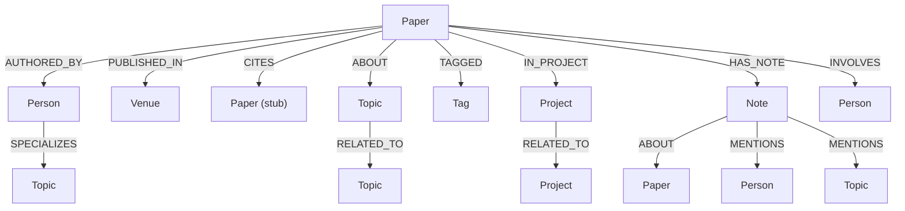

# Data Model

PaperManager uses **Neo4j Aura** (a cloud-hosted graph database) to store all entities and their relationships.

---

## Node Labels

### Paper

The central entity. Every ingested paper is a `Paper` node.

| Property | Type | Description |
|----------|------|-------------|
| `id` | string (UUID) | Internal identifier |
| `title` | string | Paper title |
| `year` | integer | Publication year |
| `doi` | string | DOI if available |
| `abstract` | string | Original abstract |
| `summary` | string | AI-generated summary (Claude Opus) |
| `raw_text` | string | Full extracted PDF text |
| `drive_file_id` | string | Google Drive file ID for the PDF |
| `citation_count` | integer | From Semantic Scholar |
| `metadata_source` | string | How metadata was obtained (see below) |
| `created_at` | datetime | When added to the system |
| `updated_at` | datetime | Last modification time |

### Person

Authors, collaborators, colleagues.

| Property | Type | Description |
|----------|------|-------------|
| `id` | string (UUID) | Internal identifier |
| `name` | string | Full name |
| `affiliation` | string | Institution or company |
| `email` | string | Optional contact |

### Topic

Formal research areas.

| Property | Type | Description |
|----------|------|-------------|
| `id` | string (UUID) | Internal identifier |
| `name` | string | Topic name, title-case (e.g. `"Protein Structure Prediction"`) |
| `description` | string | Optional longer description |

### Tag

Free-form personal labels.

| Property | Type | Description |
|----------|------|-------------|
| `id` | string (UUID) | Internal identifier |
| `name` | string | Label (e.g. `"to-read"`, `"from-karin"`) |

### Venue

Journal or conference.

| Property | Type | Description |
|----------|------|-------------|
| `id` | string (UUID) | Internal identifier |
| `name` | string | Venue name |
| `type` | string | `"journal"` / `"conference"` / `"preprint"` |

### Note

Markdown note attached to a paper.

| Property | Type | Description |
|----------|------|-------------|
| `id` | string (UUID) | Internal identifier |
| `content` | string | Markdown text |
| `created_at` | datetime | Creation time |
| `updated_at` | datetime | Last edit time |

### Project

Named collection of papers.

| Property | Type | Description |
|----------|------|-------------|
| `id` | string (UUID) | Internal identifier |
| `name` | string | Project name |
| `description` | string | What this project is about |
| `status` | string | `"active"` / `"paused"` / `"done"` |
| `created_at` | datetime | Creation time |

### Figure

Extracted figure from a PDF.

| Property | Type | Description |
|----------|------|-------------|
| `id` | string (UUID) | Internal identifier |
| `paper_id` | string | ID of parent paper |
| `figure_number` | integer | Sequential figure number |
| `caption` | string | Auto-generated caption |
| `drive_file_id` | string | Google Drive file ID for the image |
| `page_number` | integer | PDF page the figure was on |

---

## Relationships



### Bibliographic

| Relationship | Direction | Description |
|-------------|-----------|-------------|
| `AUTHORED_BY` | Paper → Person | Author of the paper |
| `PUBLISHED_IN` | Paper → Venue | Journal/conference |
| `CITES` | Paper → Paper | Citation; target may be a stub node |

### Classification

| Relationship | Direction | Description |
|-------------|-----------|-------------|
| `ABOUT` | Paper → Topic | Paper covers this research area |
| `TAGGED` | Paper → Tag | Free-form label applied to paper |

### Workflow

| Relationship | Direction | Properties | Description |
|-------------|-----------|------------|-------------|
| `IN_PROJECT` | Paper → Project | — | Paper belongs to project |
| `HAS_NOTE` | Paper → Note | — | Paper has a note |
| `INVOLVES` | Paper → Person | `role: string` | Non-author workflow relationship |

#### INVOLVES roles

| Role | Meaning |
|------|---------|
| `shared_by` | This person shared the paper with you |
| `working_on` | This person is working on this topic/paper |
| `collaborating` | You are collaborating with this person |
| `feedback_needed` | You need feedback from this person |
| `supervisor` | Supervisor for this work |

### Notes

| Relationship | Direction | Description |
|-------------|-----------|-------------|
| `ABOUT` | Note → Paper | Note belongs to paper |
| `MENTIONS` | Note → Person | `@PersonName` in note text |
| `MENTIONS` | Note → Topic | `#TopicName` in note text |

### People & Projects

| Relationship | Direction | Description |
|-------------|-----------|-------------|
| `SPECIALIZES` | Person → Topic | Research specialty |
| `RELATED_TO` | Project ↔ Project | Bidirectional project link |
| `RELATED_TO` | Topic ↔ Topic | Bidirectional topic link |

---

## Fulltext Indexes

| Index name | Nodes | Properties | Used by |
|------------|-------|------------|---------|
| `paper_search` | Paper | `title`, `abstract`, `summary` | `/search` endpoint |
| `note_search` | Note | `content` | Note search |

---

## metadata_source Values

Records which metadata extraction layer was used for each paper:

| Value | Description |
|-------|-------------|
| `semantic_scholar` | Fetched from Semantic Scholar API |
| `crossref` | Fetched from CrossRef API |
| `arxiv` | Fetched from arXiv Atom API |
| `pubmed` | Fetched from PubMed eUtils |
| `biorxiv` / `medrxiv` | Fetched from bioRxiv/medRxiv API |
| `llm` | Extracted by Ollama LLM from PDF text |
| `heuristic` | Guessed from first lines of PDF |
| `bulk` | Added via bulk import |

---

## Example Graph Fragment

```
(Paper "Attention Is All You Need")
  -[:AUTHORED_BY]→ (Person "Vaswani")
  -[:PUBLISHED_IN]→ (Venue "NeurIPS")
  -[:ABOUT]→ (Topic "Transformers")
  -[:ABOUT]→ (Topic "Natural Language Processing")
  -[:TAGGED]→ (Tag "arxiv")
  -[:TAGGED]→ (Tag "foundational")
  -[:IN_PROJECT]→ (Project "PhD thesis")
  -[:INVOLVES {role: "feedback_needed"}]→ (Person "Nele")
  -[:INVOLVES {role: "shared_by"}]→ (Person "Karin")
  -[:HAS_NOTE]→ (Note "Key insight: attention mechanism replaces RNNs…")
  -[:CITES]→ (Paper "Neural Machine Translation by…")

(Person "Jan")
  -[:SPECIALIZES]→ (Topic "Transformers")

(Project "PhD thesis")-[:RELATED_TO]→(Project "Collaboration TU Berlin")
```
