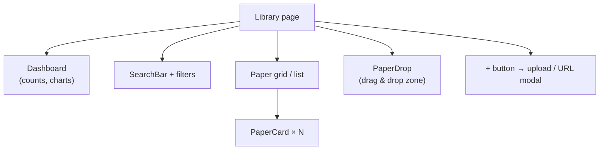
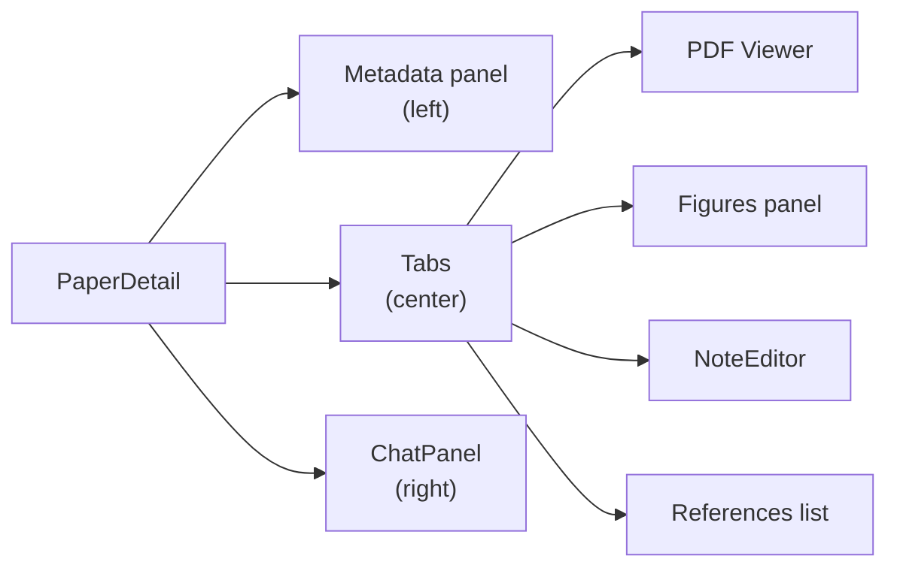

# Frontend

The frontend is a **React + TypeScript** single-page application built with **Vite** and styled with **Tailwind CSS**.

---

## Directory Layout

```
frontend/
├── index.html
├── package.json
├── vite.config.ts
├── tsconfig.json
│
└── src/
    ├── main.tsx             # React entry point (ReactDOM.createRoot)
    ├── App.tsx              # Router setup (React Router v7)
    ├── App.css
    ├── index.css
    │
    ├── api/
    │   └── client.ts        # All fetch calls to the backend (typed)
    │
    ├── types/
    │   └── index.ts         # TypeScript types matching backend Pydantic schemas
    │
    ├── contexts/            # React context providers
    │
    ├── components/          # Reusable UI components
    │   ├── PaperDrop.tsx    # Drag-and-drop PDF upload zone
    │   ├── PaperCard.tsx    # Paper summary card (grid / list view)
    │   ├── NoteEditor.tsx   # Markdown editor with @/# autocomplete
    │   ├── ChatPanel.tsx    # Chat sidebar (single paper)
    │   ├── EditPaperModal.tsx  # Edit paper metadata modal
    │   ├── UploadConfirmModal.tsx  # Multi-step upload confirmation modal
    │   └── EntityPanel.tsx  # Knowledge graph node properties panel
    │
    └── pages/
        ├── Library.tsx      # Main view: paper grid + filters + dashboard
        ├── PaperDetail.tsx  # Single paper: metadata, PDF, figures, notes, chat
        ├── People.tsx       # People list + person detail
        ├── Projects.tsx     # Project list + project detail
        ├── Graph.tsx        # Knowledge graph (WebGL force-graph)
        ├── KnowledgeChat.tsx # Multi-paper AI chat
        ├── Cypher.tsx       # Cypher editor
        ├── Settings.tsx     # App settings
        └── BulkImport.tsx   # Bulk import page
```

---

## Routing

React Router v7 defines the page routes in `App.tsx`:

| Route | Page component | Description |
|-------|---------------|-------------|
| `/` | `Library` | Paper grid, search, filters, dashboard |
| `/paper/:id` | `PaperDetail` | Single paper detail |
| `/people` | `People` | People list and detail |
| `/projects` | `Projects` | Project list and detail |
| `/graph` | `Graph` | Knowledge graph visualisation |
| `/knowledge` | `KnowledgeChat` | Multi-paper AI chat |
| `/cypher` | `Cypher` | Cypher query editor |
| `/bulk-import` | `BulkImport` | Bulk paper import |
| `/settings` | `Settings` | Application settings |

---

## API Client (api/client.ts)

All communication with the backend goes through `api/client.ts`. It provides typed async functions for every backend endpoint:

```typescript
// Example pattern
export async function getPapers(params?: PaperListParams): Promise<Paper[]> {
  const res = await fetch(`${API_BASE}/papers?${buildQuery(params)}`);
  if (!res.ok) throw new Error(await res.text());
  return res.json();
}

export async function uploadPaper(file: File, options: UploadOptions): Promise<Paper> {
  const form = new FormData();
  form.append("file", file);
  // ...
  const res = await fetch(`${API_BASE}/papers/upload`, { method: "POST", body: form });
  return res.json();
}
```

SSE endpoints (bulk import, knowledge chat) use the `EventSource` API or `fetch` with `ReadableStream`.

---

## Key Pages

### Library (`Library.tsx`)



**State:** search query, active filters (tag, topic, project, person), view mode, sort, page number.

### PaperDetail (`PaperDetail.tsx`)



**State:** paper data, active tab, note content, chat history, figures list.

### Graph (`Graph.tsx`)

Uses **force-graph** (WebGL-powered `force-graph` library) to render the knowledge graph.

- Fetches node/edge data from `GET /graph?mode=...`
- Renders nodes with colour-coded types
- Click handler opens `EntityPanel` for node details

### KnowledgeChat (`KnowledgeChat.tsx`)

- Manages a list of conversations
- Sends messages to `POST /knowledge-chat/stream` (SSE)
- Renders streaming response token by token
- Shows context visualisation (token budget bar chart)

---

## Key Components

### NoteEditor (`NoteEditor.tsx`)

A Markdown editor with two modes:

- **Edit mode** — textarea with `@`/`#` autocomplete dropdown
- **Preview mode** — renders Markdown via `react-markdown`

Autocomplete resolves `@` → people names, `#` → topic names from the backend.

### UploadConfirmModal (`UploadConfirmModal.tsx`)

Multi-step wizard shown after a PDF is dropped:

1. Metadata review (extracted metadata, duplicate warning)
2. Source selection (how did you find this paper?)
3. Summary prompt editor
4. References review
5. Tag review

Each step is optional and can be skipped via Settings.

### ChatPanel (`ChatPanel.tsx`)

Single-paper chat sidebar:

- Model selector (Claude Opus, Claude Work, Ollama)
- Message history display
- Streaming response rendering
- Input with send button

### PaperCard (`PaperCard.tsx`)

Used in both grid and list view. Renders:

- Title with link to PaperDetail
- Year, authors, metadata source badge
- Abstract preview (if enabled in settings)
- Tag pills
- Edit / delete action buttons

---

## State Management

The app uses **React's built-in state** (`useState`, `useEffect`, `useContext`) with no external state library.

Settings are persisted to `localStorage` via a custom hook in `contexts/`.

---

## Dependencies

| Package | Version | Purpose |
|---------|---------|---------|
| `react` | 19 | UI framework |
| `react-router-dom` | 7 | Client-side routing |
| `tailwindcss` | 4 | Utility-first CSS |
| `@tailwindcss/typography` | 0.5 | Prose / Markdown styling |
| `force-graph` | 1.51 | WebGL graph visualisation |
| `react-markdown` | 10 | Markdown rendering |
| `react-dropzone` | 15 | Drag-and-drop PDF upload |

---

## Development

```bash
cd frontend
npm install
npm run dev      # Starts Vite dev server on :5173

npm run build    # Production build → dist/
npm run lint     # ESLint check
```

The Vite config proxies `/api` requests to `http://localhost:8000` during development.
