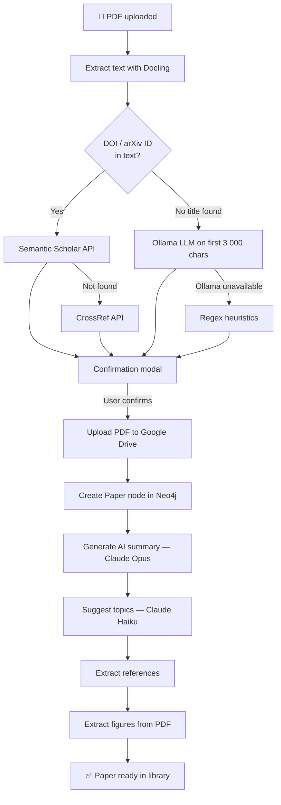
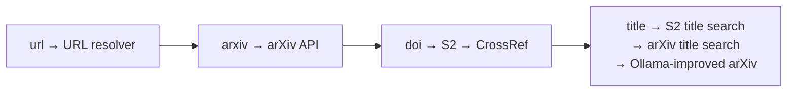

# Ingesting Papers

PaperManager supports three ways to add papers to your library.

---

## PDF Upload

Drag a PDF onto the Library page or click the **+** button → **PDF** tab.

### What Happens Automatically

The upload follows a multi-step pipeline:



### Step-by-Step: The Upload Modal

After choosing a PDF you walk through up to five optional steps (each can be toggled in [Settings](../user-guide/getting-started.md)):

1. **Metadata confirmation** — review extracted title, year, authors, DOI, venue; fix any errors
2. **Source** — record how you found this paper (person, LinkedIn, Twitter, conference, newsletter…)
3. **Summary prompt** — edit the Claude prompt before the AI summary is generated
4. **References review** — approve which references to save as `CITES` links
5. **Tags** — review AI-suggested tags before saving

### Upload Modal Options

| Option | Default | Description |
|--------|---------|-------------|
| Source step | on | Record how you found the paper |
| Summary prompt step | on | Edit the AI summary instructions |
| Auto-save references | off | Skip review and save all references automatically |
| Tags step | on | Review AI-suggested tags before saving |

### Metadata Source Badge

After upload each paper card shows a colour-coded badge:

| Colour | Source |
|--------|--------|
| 🟢 Green | Semantic Scholar or CrossRef |
| 🟡 Yellow | Ollama LLM extraction |
| 🔴 Red | Heuristic guess |

---

## URL / DOI Ingest

Click **+** → **URL / DOI** tab. Paste any of:

| Input format | Example |
|---|---|
| arXiv URL | `https://arxiv.org/abs/1706.03762` |
| arXiv ID | `1706.03762` or `arXiv:1706.03762` |
| DOI URL | `https://doi.org/10.1038/nature14539` |
| Bare DOI | `10.1038/nature14539` |
| PubMed URL | `https://pubmed.ncbi.nlm.nih.gov/12345678/` |
| bioRxiv URL | `https://www.biorxiv.org/content/10.1101/...` |
| medRxiv URL | `https://www.medrxiv.org/content/10.1101/...` |

### What Happens

1. The URL/ID is parsed to detect the source type
2. Metadata is fetched from the appropriate API (arXiv Atom, Semantic Scholar, CrossRef, PubMed eUtils, bioRxiv)
3. If a DOI is found, Semantic Scholar is queried for richer data (citation count, affiliations, topics)
4. Paper is auto-tagged `from-url`
5. No PDF is stored — the paper is metadata-only

!!! note
    To get a PDF for a URL-ingested paper, open the Paper Detail page and click **Upload PDF**.

---

## Bulk Import

Go to **Bulk Import** in the nav bar. Upload or paste a JSON file:

```json
{
  "fetch_pdf": true,
  "project_id": "optional-project-uuid",
  "papers": [
    {"url": "https://arxiv.org/abs/1706.03762"},
    {"arxiv": "1810.04805"},
    {"doi": "10.1038/nature14539"},
    {"url": "https://pubmed.ncbi.nlm.nih.gov/30082513/"},
    {"title": "AlphaFold protein structure prediction"},
    {"title": "CRISPR-Cas9 genome editing", "fetch_pdf": false}
  ]
}
```

Each entry needs at least one of: `url`, `arxiv`, `doi`, `title`. Formats can be mixed freely.

A sample file is included at `sample_bulk_import.json`.

### Resolution Order

For each paper entry the system tries, in order:



### PDF Fetching

When `fetch_pdf: true`:

- **arXiv papers** — downloaded from `arxiv.org/pdf/{id}`
- **Other papers** — Unpaywall API checked for an open-access PDF URL

### Progress Stream

Bulk import shows a live log stream as papers are processed. Papers that already exist by DOI are reported as "skipped". All imported papers are auto-tagged `bulk-import`.

!!! tip "Project assignment"
    Set `"project_id"` in the JSON to automatically add all imported papers to a project.

---

## Duplicate Detection

Before a paper is saved, a duplicate check runs against existing papers:

- Exact DOI match → blocked (the paper already exists)
- High title similarity → warning shown in the confirmation modal

If a DOI-matched stub already exists (from reference extraction), the stub is enriched with full metadata rather than creating a duplicate.
