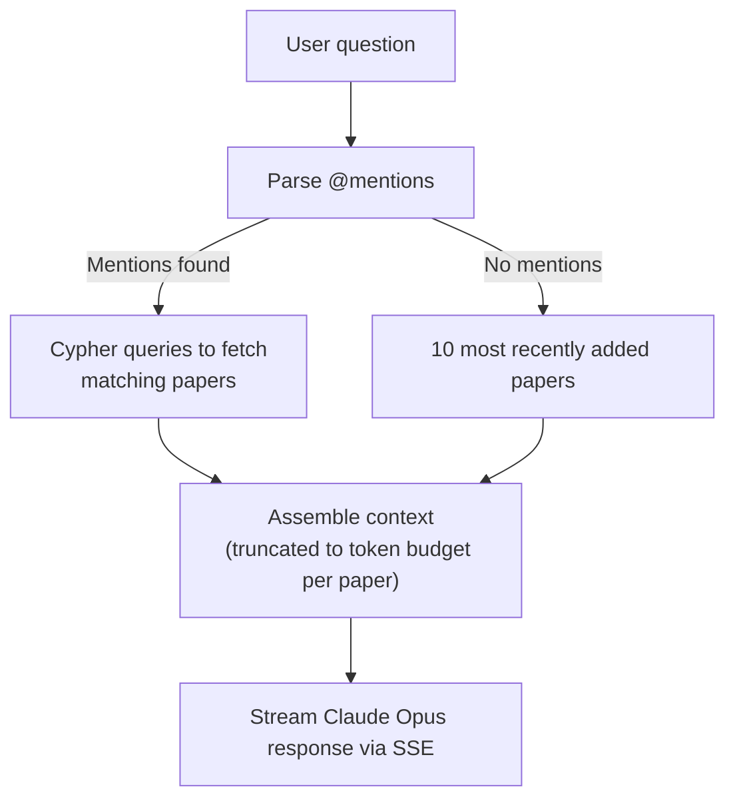

# Knowledge Features

PaperManager includes three advanced knowledge tools: an interactive graph, a multi-paper AI chat, and a direct Cypher query editor.

---

## Knowledge Graph

Navigate to **Graph** in the nav bar for an interactive WebGL visualisation of your entire library.

### Node Types

| Colour | Node type |
|--------|-----------|
| 🟣 Purple | Paper |
| 🔵 Blue | Person |
| 🟢 Green | Topic |
| 🟠 Orange | Tag |
| 🩷 Pink | Project |
| ⚫ Grey | Note |

### Controls

- **Pan** — click and drag the background
- **Zoom** — scroll or pinch
- **Move nodes** — drag individual nodes
- **Click a node** — opens a properties panel on the right:
  - View all node properties
  - Navigate to the paper detail page
  - Delete the node

### Graph Modes

| Mode | What is shown |
|------|---------------|
| **Full graph** | All node types (up to 500 nodes) |
| **Papers only** | Papers, People, Topics |
| **Single paper** | One paper with all its direct neighbours |

Switch modes using the toggle in the top-left of the graph.

### Display Options

Use the sliders and toggles in the control panel to adjust:

- **Node size**
- **Link distance**
- **Repulsion force**
- **Show / hide node labels**
- **Show / hide edge labels**

---

## Knowledge Chat

Navigate to **Knowledge** in the nav bar to chat with Claude about multiple papers at once.

### Conversation

Type a question. By default the 10 most recently added papers are used as context.

Use `@mentions` to bring specific papers or groups into context:

| Mention syntax | What is loaded |
|----------------|----------------|
| `@paper:Attention is All You Need` | That specific paper |
| `@tag:deep-learning` | All papers with that tag |
| `@topic:Protein Folding` | All papers about that topic |
| `@project:my-phd-papers` | All papers in that project |

### Example Prompts

```
@tag:deep-learning What are the main architectural differences across these papers?

@topic:Protein Folding How has the approach changed from RoseTTAFold to AlphaFold?

@project:my-phd-papers Summarise the key open problems.

@paper:Attention is All You Need What positional encoding does this use?
```

### Features

| Feature | Description |
|---------|-------------|
| **SSE streaming** | Answer appears token by token |
| **Step-by-step progress** | Shows which Cypher queries fetch context, how many papers are loaded |
| **Context visualisation** | Stacked bar chart of token usage per paper |
| **Model selector** | Claude Opus, Claude Work (enterprise), Ollama |
| **Conversation history** | Create new conversations, load previous ones |
| **Compact** | Summarise conversation history into a system message to free up context |

### Context Assembly



---

## Cypher Editor

Navigate to **Cypher** in the nav bar for direct access to the Neo4j database.

### Schema Browser

A live view of all:

- Node labels and their property keys
- Relationship types
- Fulltext indexes

### Query Editor

Write and run raw Cypher queries. Results are shown in a table. Mutation counters show nodes created/deleted, relationships created/deleted, and properties set. Maximum 500 rows are returned.

### AI Assist

Describe what you want in plain English — Ollama generates the Cypher query for you. You can then review and run it.

### Example Queries

```cypher
-- Papers citing a specific paper
MATCH (a:Paper)-[:CITES]->(b:Paper {title: "..."})
RETURN a.title, a.year

-- Most connected authors
MATCH (p:Person)<-[:AUTHORED_BY]-(paper:Paper)
RETURN p.name, count(paper) AS papers ORDER BY papers DESC LIMIT 10

-- Papers without summaries
MATCH (p:Paper) WHERE p.summary IS NULL RETURN p.title, p.year

-- All papers on a topic
MATCH (p:Paper)-[:ABOUT]->(t:Topic {name: "Transformers"})
RETURN p.title, p.year ORDER BY p.year DESC

-- Papers shared by a colleague
MATCH (person:Person {name: "Jan"})<-[:INVOLVES {role: "shared_by"}]-(p:Paper)
RETURN p.title, p.year
```

---

## People

Navigate to **People** in the nav bar.

All people in the system are listed in the sidebar with search.

**Person detail** shows:

- Name and affiliation
- Papers where they are an **author** (`AUTHORED_BY`)
- Papers where they have an **INVOLVES role** (shared_by, working_on, collaborating, etc.)
- **Research specialties** (linked `Topic` nodes via `SPECIALIZES`)

People are auto-created when papers are ingested from the author list.

---

## Projects

Navigate to **Projects** in the nav bar.

Create named collections of papers:

- Create a project with name, description, and status (`active` / `paused` / `done`)
- Add/remove papers from a project
- Papers can belong to multiple projects
- Filter the library by project
- Link projects as related (`RELATED_TO`)
- Select a project during upload, URL ingest, or bulk import to add papers automatically

---

## Export & Backfill

### Export

| Format | How |
|--------|-----|
| **BibTeX** | `GET /export/bibtex` — downloads a `.bib` file containing all papers |
| **JSON** | Available from the Settings page |

### Backfill (Bulk Enrichment)

Run from the Settings page or directly via the API:

| Operation | Endpoint | Description |
|-----------|----------|-------------|
| Backfill topics | `POST /backfill/topics` | Run Claude Haiku topic suggestion on all papers without topics |
| Backfill summaries | `POST /backfill/summary` | Generate AI summaries for papers that have `raw_text` but no summary |
| Backfill figures | `POST /backfill/figures` | Extract figures from all papers that have a PDF but no figures yet |

Each returns `{processed, skipped, errors}`.
