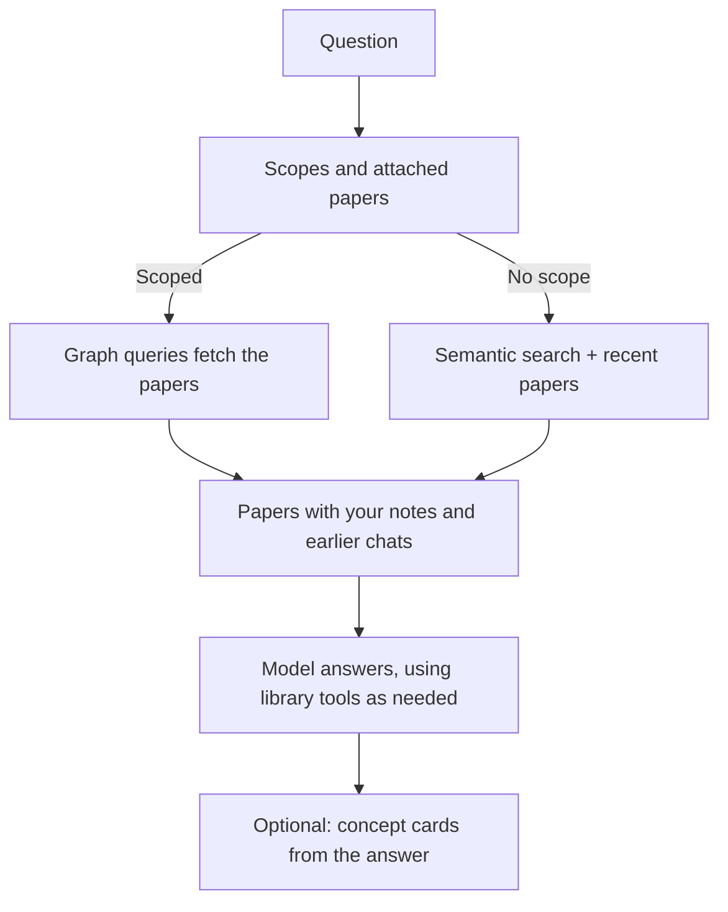
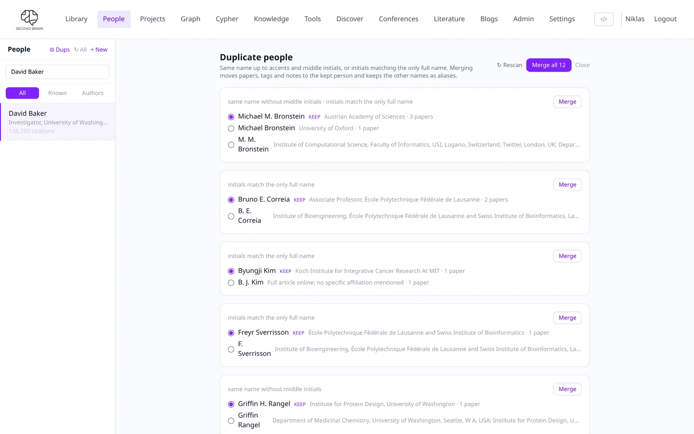

# Knowledge Features

PaperManager includes three advanced knowledge tools: an interactive graph, a multi-paper AI chat, and a direct Cypher query editor.

---

## Knowledge Graph

Navigate to **Graph** in the nav bar for an interactive WebGL visualisation of your entire library.

### Node Types

| Colour | Node type |
|--------|-----------|
| 🟣 Purple | Paper |
| 🔵 Blue | Person |
| 🟢 Green | Topic |
| 🟠 Orange | Tag |
| 🩷 Pink | Project |
| ⚫ Grey | Note |

### Controls

- **Pan** — click and drag the background
- **Zoom** — scroll or pinch
- **Move nodes** — drag individual nodes
- **Click a node** — opens a properties panel on the right:
  - View all node properties
  - Navigate to the paper detail page
  - Delete the node

### Graph Modes

| Mode | What is shown |
|------|---------------|
| **Full graph** | All node types (up to 500 nodes) |
| **Papers only** | Papers, People, Topics |
| **Single paper** | One paper with all its direct neighbours |

Switch modes using the toggle in the top-left of the graph.

### Display Options

Use the sliders and toggles in the control panel to adjust:

- **Node size**
- **Link distance**
- **Repulsion force**
- **Show / hide node labels**
- **Show / hide edge labels**

---

## Knowledge Chat

Navigate to **Knowledge** in the nav bar to ask questions across your whole library. The page has three parts:
your conversations on the left, the chat in the middle, and a preview pane on the right that opens when you click a
cited paper or a figure.

### Asking

Type a question and press Enter (Shift+Enter for a new line). Without a scope, the chat finds relevant papers by
semantic search and adds the most recent ones. To choose the context yourself:

| In the composer | What is loaded |
|----------------|----------------|
| `@project:my-phd-papers` | Papers in that project |
| `@topic:Protein Folding` | Papers about that topic |
| `@tag:deep-learning` | Papers with that tag |
| `@paper:Attention is All You Need` | Papers whose title matches |
| `@person:lecun` | Papers by or involving that person |
| `@user:alice` | Asks a teammate's conversations instead of the library |
| **+ paper** | Attaches one library paper; it is always in context |

Typing `@` suggests projects, topics, tags, people and papers; the scopes you use show as chips above the text. While
the model works, the steps it takes (graph queries, searches, reading a paper's full text, listing its figures,
searching the web) appear as rows above the answer; click one to see the query or the papers it found. **Stop**
ends an answer early.

The bar under the text holds **web** (allow web search), **concepts** (make concept cards for every answer),
and the model: Claude with your API key, Claude Code on a Claude subscription (if the server owner enabled it for
you), Claude (Work), or the self-hosted LiteLLM model.

### Answers

Answers render maths, code, tables and figures from your papers. Library papers are cited as violet links: click
one to open its summary, abstract, figures and PDF beside the chat, or **Open in library** for the full paper page.
Under each answer you see the papers it cited and how many were in context.

**Concept cards.** Press **✦ Visualise** under an answer (or switch **concepts** to auto) and the app finds the ideas
in the answer that a picture would explain, then attaches an interactive card at the end of the section that
discusses each: a formula walked through step by step, a graph, a short sourced note, or an animation with pause,
play, speed (0.5×, 1×, 2×) and replay. Formulas and graphs take about a minute, animations a few. If an animation
breaks, **fix** asks the model to repair it. The cards are saved with the conversation.

**3D structures.** When a question is about a protein or another molecule, the answer can show it in 3D: an
experimental structure from the PDB, or an AlphaFold DB prediction coloured by confidence (pLDDT). Drag to rotate,
scroll to zoom, hover to name a residue, click residues to collect them; the card has surface, spin, reset,
fullscreen and PNG export, and chips that toggle the highlighted regions. Asking for a structure by its PDB id
("show 6VXX and highlight the receptor-binding domain") works well.

### Conversations and strands

Conversations are saved automatically and listed newest first; search them, rename or delete them on hover, and
start a new one with **+ New**. **compact** summarises older turns to free up context in a long conversation.

Hover one of your questions to fork the conversation: **⑂ edit** starts a copy just before that question with its
text back in the composer, **⑂ strand** continues a copy from that answer. The original stays as it was. Strands
are nested under their conversation in the list, and the line beside the transcript shows where each one left;
click its knob to open it, or the ↑ link above the title to go back.

### Example prompts

```
@topic:Protein Folding How has the approach changed from RoseTTAFold to AlphaFold 3?

Explain the denoising score-matching objective behind diffusion models, with the derivation.

Show the SARS-CoV-2 spike protein (6VXX) in 3D and highlight the receptor-binding domain.

@project:my-phd-papers Summarise the key open problems.
```

### Context

The strip above the chat shows how much of the model's context window the question uses, split into system
prompt, papers, conversation, question and answer. Click it to see which papers are in context.


```mermaid
flowchart TD
    Q["Question"] --> P["Scopes and attached papers"]
    P -->|"Scoped"| C["Graph queries fetch the papers"]
    P -->|"No scope"| R["Semantic search + recent papers"]
    C --> A["Papers with your notes and earlier chats"]
    R --> A
    A --> M["Model answers, using library tools as needed"]
    M --> V["Optional: concept cards from the answer"]
```

---

## Cypher Editor

Navigate to **Cypher** in the nav bar for direct access to the Neo4j database.

### Schema Browser

A live view of all:

- Node labels and their property keys
- Relationship types
- Fulltext indexes

### Query Editor

Write and run raw Cypher queries. Results are shown in a table. Mutation counters show nodes created/deleted, relationships created/deleted, and properties set. Maximum 500 rows are returned.

### AI Assist

Describe what you want in plain English — Ollama generates the Cypher query for you. You can then review and run it.

### Example Queries

```cypher
-- Papers citing a specific paper
MATCH (a:Paper)-[:CITES]->(b:Paper {title: "..."})
RETURN a.title, a.year

-- Most connected authors
MATCH (p:Person)<-[:AUTHORED_BY]-(paper:Paper)
RETURN p.name, count(paper) AS papers ORDER BY papers DESC LIMIT 10

-- Papers without summaries
MATCH (p:Paper) WHERE p.summary IS NULL RETURN p.title, p.year

-- All papers on a topic
MATCH (p:Paper)-[:ABOUT]->(t:Topic {name: "Transformers"})
RETURN p.title, p.year ORDER BY p.year DESC

-- Papers shared by a colleague
MATCH (person:Person {name: "Jan"})<-[:INVOLVES {role: "shared_by"}]-(p:Paper)
RETURN p.title, p.year
```

---

## People

Navigate to **People** in the nav bar.

!!! info "Contributed by Antoine Luciano"
    Surname order, the CV tab and the duplicate finder come from
    [Antoine Luciano](https://github.com/AntoineLuciano)
    ([#36](https://github.com/NiklasAbraham/PaperManager/pull/36)).

All people in the system are listed in the sidebar with search, sorted by surname
("Christian P. Robert" under R; a particle stays with the given names, so "Aad van der Vaart" is under V).

**Person detail** shows:

- Name and affiliation
- Papers where they are an **author** (`AUTHORED_BY`)
- Papers where they have an **INVOLVES role** (shared_by, working_on, collaborating, etc.)
- **Research specialties** (linked `Topic` nodes via `SPECIALIZES`)

- **CV** tab: current position, education, past affiliations, h-index, citations, topics and most
  cited works, built by **↻ CV** from OpenAlex, ORCID, Wikidata (photo, homepage) and the person's
  homepage. Before trusting a profile it checks the person is really an author of their papers in
  the library; a profile found by name alone is accepted only if it lists one of those papers,
  since common names have many homonyms. The status dot says how it went: green (consistent with
  the library papers), amber (mostly), red (probably a homonym or a wrong author link), grey (no
  profile found).


People are auto-created when papers are ingested from the author list.

### Duplicate people

The same researcher often arrives under several spellings ("Alán Aspuru-Guzik" and
"Al'an Aspuru-Guzik", "Nele P. Quast" and "Nele Quast", "C. P. Robert" and "Christian P. Robert").
**⧉ Dups** at the top of the sidebar lists the groups that look like one person, with the rule
that linked them. Pick which one to keep (the one with a Semantic Scholar id or the most papers
is preselected) and **Merge**, or **Merge all**. The kept person gets every paper, tag and note
of the others, fills its empty fields from theirs, and keeps their names as aliases. An initial
is joined to a full name only when one full name fits ("C. Robert" stays alone next to both
"Christian Robert" and "Claire Robert"). `backend/scripts/merge_people.py` applies the same rules
from the command line.



---

## Projects

Navigate to **Projects** in the nav bar.

Create named collections of papers:

- Create a project with name, description, and status (`active` / `paused` / `done`)
- Add/remove papers from a project
- Papers can belong to multiple projects
- Filter the library by project
- Link projects as related (`RELATED_TO`)
- Select a project during upload, URL ingest, or bulk import to add papers automatically

---

## Export & Backfill

### Export

| Format | How |
|--------|-----|
| **BibTeX** | `GET /export/bibtex` — downloads a `.bib` file containing all papers |
| **JSON** | Available from the Settings page |

### Backfill (Bulk Enrichment)

Run from the Settings page or directly via the API:

| Operation | Endpoint | Description |
|-----------|----------|-------------|
| Backfill topics | `POST /backfill/topics` | Run Claude Haiku topic suggestion on all papers without topics |
| Backfill summaries | `POST /backfill/summary` | Generate AI summaries for papers that have `raw_text` but no summary |
| Backfill figures | `POST /backfill/figures` | Extract figures from all papers that have a PDF but no figures yet |

Each returns `{processed, skipped, errors}`.
