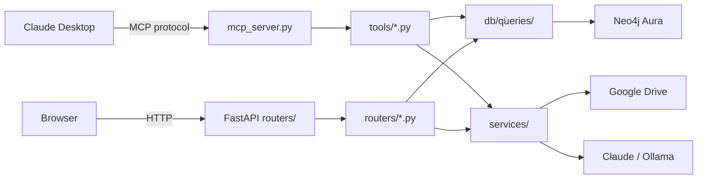

# MCP Server (Claude Desktop)

PaperManager ships with an [MCP (Model Context Protocol)](https://modelcontextprotocol.io/) server at `backend/mcp_server.py`. This lets **Claude Desktop** interact with your library directly via natural language.

---

## Setup

### 1 — Locate your Python binary

```bash
conda activate papermanager
which python
# e.g. /Users/you/miniconda3/envs/papermanager/bin/python
```

### 2 — Configure Claude Desktop

Edit `~/.claude/claude_desktop_config.json`:

```json
{
  "mcpServers": {
    "paperManager": {
      "command": "/path/to/conda/envs/papermanager/bin/python",
      "args": ["/path/to/PaperManager/backend/mcp_server.py"]
    }
  }
}
```

Replace the paths with your actual paths. Restart Claude Desktop.

### 3 — Verify

Ask Claude: *"Can you list my recent papers?"* — Claude should call `search_papers` and return results from your library.

---

## Available Tools

| Tool | Description |
|------|-------------|
| `search_papers` | Search by keyword, tag, topic, project, or person |
| `get_paper_detail` | Full paper metadata for one paper |
| `chat_with_paper` | Ask a question about a paper's content |
| `add_note` | Write or update a paper's markdown note |
| `get_note` | Read a paper's note |
| `tag_paper_with` | Add a tag to a paper |
| `add_topic` | Link a research topic to a paper |
| `link_person_to_paper` | Link a person to a paper with a role |
| `add_paper_metadata` | Add a paper by metadata only (no PDF) |
| `list_projects` | List all projects |
| `list_project_papers` | Papers in a specific project |
| `add_to_project` | Add a paper to a project |
| `list_tags` | All tags with paper counts |
| `list_topics` | All topics with paper counts |
| `list_people` | All people |
| `get_person_papers` | Papers associated with a person |
| `add_person` | Create a person node |
| `create_project` | Create a new project |

---

## Example Interactions

```
You: add a note to the Attention is All You Need paper saying
     "@Jan is working on a follow-up to this approach"

Claude: [calls add_note] → note saved, MENTIONS relationship
        created in Neo4j for Jan
```

```
You: what papers do I have tagged "to-read" about protein folding?

Claude: [calls search_papers with tag="to-read", topic="Protein Folding"]
        → returns matching papers
```

```
You: create a project called "NeurIPS 2025 prep" and add all papers
     tagged "important" to it

Claude: [calls create_project, then search_papers + add_to_project
        for each paper]
```

---

## Architecture

The MCP server and FastAPI backend **share the same service and database layers**:



!!! note "PDF upload is browser-only"
    File upload is intentionally not exposed as an MCP tool — it requires the browser drag-and-drop flow.

---

## Running the MCP Server Standalone

The server can also be run without Claude Desktop for testing:

```bash
conda activate papermanager
cd /path/to/PaperManager
python backend/mcp_server.py
```

This starts the MCP server in stdio mode, ready to accept tool calls.
